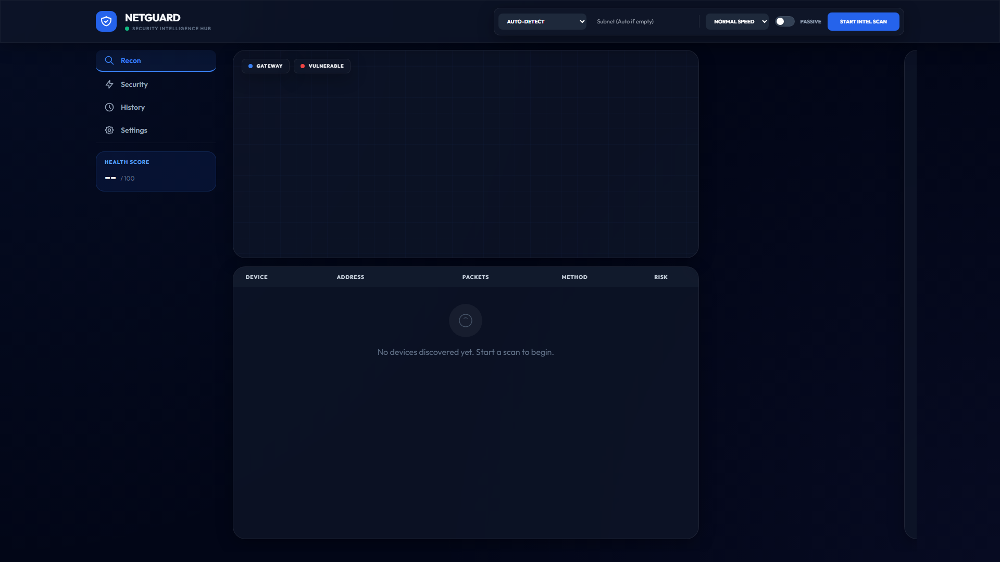
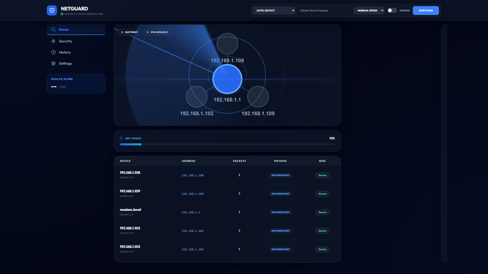
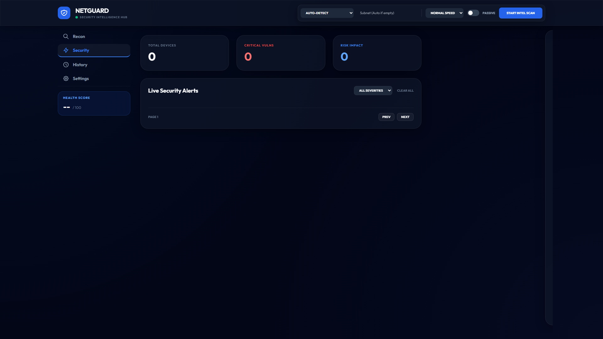
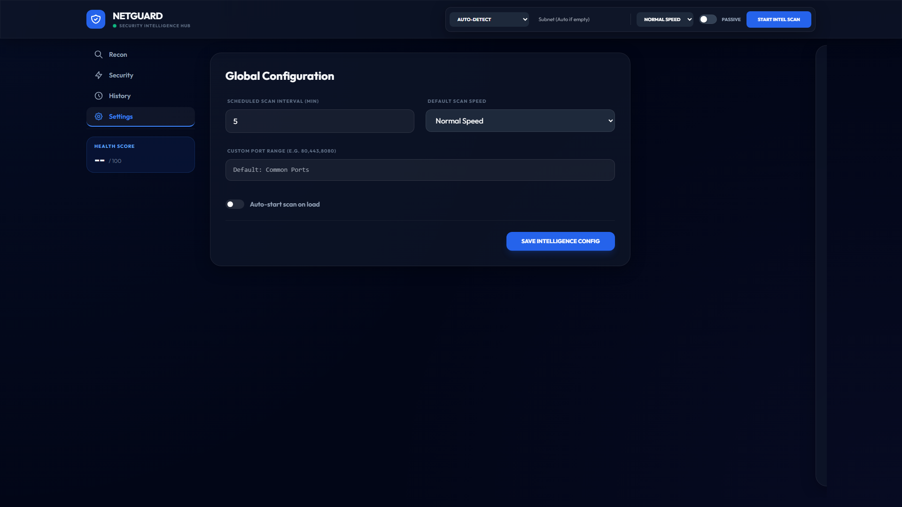

# NetGuard Security Hub 🛡️

NetGuard is a high-performance, asynchronous network security scanner designed for real-time network discovery, vulnerability assessment, and threat intelligence. Built with FastAPI and Scapy, it provides a professional-grade dashboard for monitoring local network security.

## 📸 Interface Preview

<p align="center">
  
  <br>
  <em>Main Reconnaissance Dashboard featuring dynamic Network Topology and real-time device discovery.</em>
</p>

<p align="center">
  
  <br>
  <em>Live Network Topology Mapping: Visualizing device connections and gateway distribution.</em>
</p>

<p align="center">
  
  
  <br>
  <em>Intelligence Hub (Security Alerts) & Global Configuration Panel</em>
</p>

---

## ✨ Key Features

- **🚀 Real-time Reconnaissance:** Fast, asynchronous ARP/ICMP discovery with dynamic network topology mapping.
- **🛡️ Vulnerability Engine:** Automatic detection of security risks using integrated NVD/CVE data feeds.
- **📊 Intelligence Hub:** Detailed security reporting with risk scores and automated health checks.
- **⚡ Modern UI/UX:** Premium dark-themed dashboard with high-tech radar animations and smooth transitions.
- **🔍 Deep Analysis:** Automated port scanning, service identification, and OS fingerprinting.
- **📅 Scheduled Audits:** Configure automated scans at custom intervals for continuous monitoring.

## 🛠️ Tech Stack

- **Backend:** Python, FastAPI, Uvicorn, Scapy, AioSQLite
- **Frontend:** HTML5, Vanilla JavaScript, CSS3 (Glassmorphism), Cytoscape.js
- **Database:** SQLite (Async)

---

## 🚀 Getting Started

### 1. Prerequisites
- **Python 3.10+**
- **Npcap (Windows):** Required for Scapy's raw packet scanning. Download from [npcap.com](https://npcap.com/) (select "Install Npcap in WinPcap API-compatible Mode").
- **Administrator Rights:** Terminal must be run as Administrator for raw socket access.

### 2. Installation
```bash
pip install -r requirements.txt
```

### 3. Usage
```bash
python main.py
```
Open [http://localhost:8001](http://localhost:8001) to access the dashboard.

## 🧪 Testing
```bash
python -m pytest tests/test_api.py -v
```
